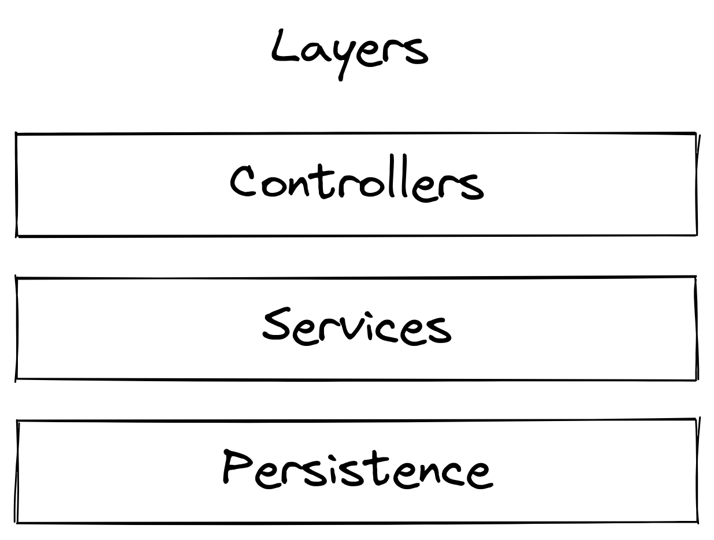
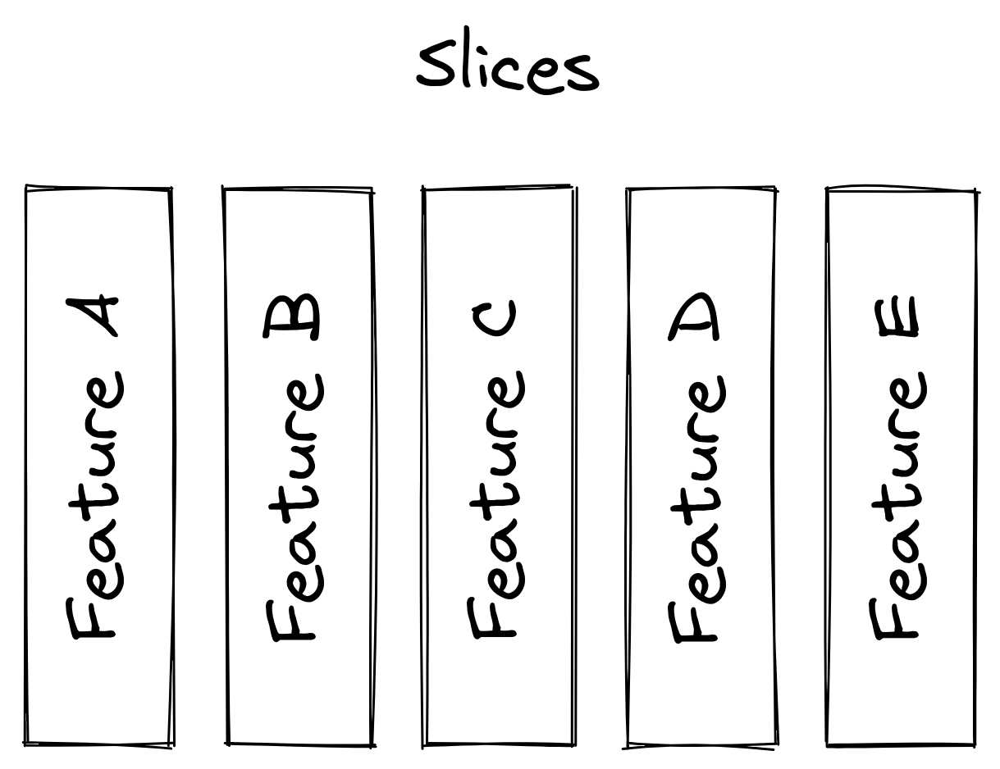
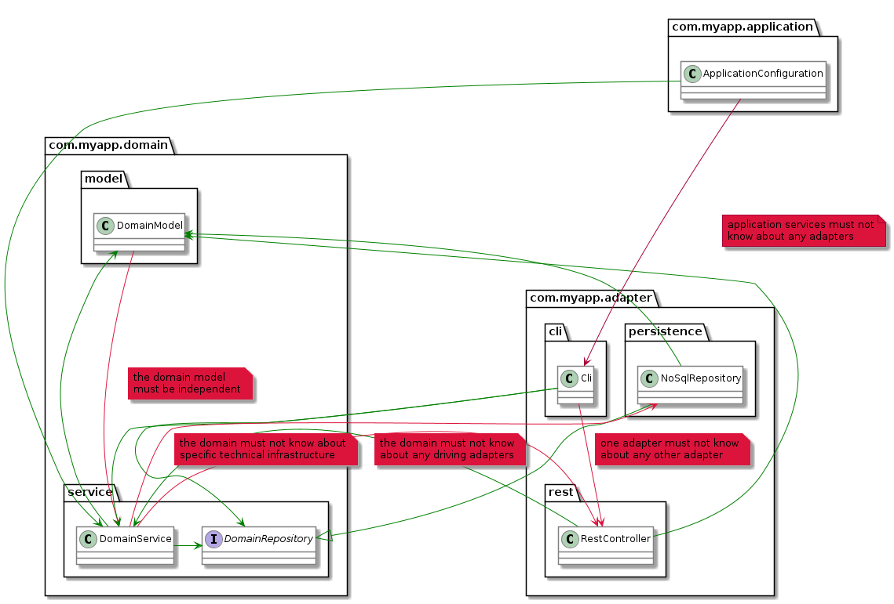

# Shoot yourself in the foot less with


`(🦶🔫)--`

---

## What?

----

### 🗜️ Enforce the architecture of your Java code.

Check every time you build.

Using the test setup you already have.

---

## Why?

----

## Prevent the big ball of mud

 <!-- .element width="50%" -->

Notes:
* We all built it: the mighty, gory monolith.
* „You reach for the banana and get the entire gorilla.“
* Hard to change incrementally, change in one part of the system causes unexpected breakages, rippling effect.

----


Notes:
* We went from monolith to microservices.

----


Notes:
* But his didn't solve all the problems magically.
* As small as possible is almost always bad advice in software design. Some logic is always going to cross those boundaries and leads to poor workarounds.

----

<!-- .element width="60%" -->

Notes:
You need microservices for two reasons:
* scaling
* aligning software architecture with team architecture.

With ArchUnit you can establish rules about package dependency without the need to put a network boundary between code (Structured Monolith).

[src](https://speakerdeck.com/jboner/reactive-microsystems-the-evolution-of-microservices-at-scale)

----

## 👑 Low coupling & high cohesion

<!-- .element style="background: #fff; padding: .5em; " -->

Notes:
* Cohesion
  * Gather into components those classes that change for the same reason and at the same times.
* Coupling
  * Do not depend on things you don't need 
  * No cyclic dependencies between components: A → B → A
  * Components depend in the direction of stability (how often does code change)
  * Either abstract & stable or concrete & unstable
* Appropriate coupling enables keeping up a steady pace while developing software

[src](https://speakerdeck.com/vladikk/balancing-coupling-in-distributed-systems?slide=74)

----

### 😰 Less fear

* of changes,
* of experiments,
* of „ugly“ (but contained) hacks

Notes:
* Fast feedback while developing

----

### 📜 Documentation for free

ArchUnit test communicate architectural intent.

And are always up to date.

---

## How?

----

## JUnit 5

```java
@AnalyzeClasses(packages = "com.mycompany.myapp")
public class MyArchitectureTest {

    @ArchTest
    public static final ArchRule myRule = classes()
        .that().resideInAPackage("..service..")
        .should().onlyBeAccessed().byAnyPackage("..controller..", "..service..");

}
```

Notes:
* Es gibt auch noch niedrig-levelligere APIs:
  * Core: wie die Java Reflection API mit zusätzlichem Dependency-Graphen
  * Lang: Abstrakte Regeln definieren, aber ohne JUnit-Abhängigkeit

----

### They see me failing

```
java.lang.AssertionError: Architecture Violation [Priority: MEDIUM] -
Rule 'no classes that reside in a package '..service..'
should access classes that reside in a package '..controller..'' was violated (1 times):
Method <some.pkg.service.SomeService.callController()>
calls method <some.pkg.controller.SomeController.execute()>
in (SomeService.java:14)
```

----

### Use cases

👉 https://www.archunit.org/use-cases

----

### 🥪 Layers

<!-- .element width="50%" -->

----

### 🥪 Layers

```java
layeredArchitecture()
    .layer("Controller").definedBy("..controller..")
    .layer("Service").definedBy("..service..")
    .layer("Persistence").definedBy("..persistence..")

    .whereLayer("Controller").mayNotBeAccessedByAnyLayer()
    .whereLayer("Service").mayOnlyBeAccessedByLayers("Controller")
    .whereLayer("Persistence").mayOnlyBeAccessedByLayers("Service")
```

----

### 🍕 Slices

<!-- .element width="50%" -->

----

### 🍕 Slices

```java
slices()
    .matching("..myapp.(**)")
    .should().notDependOnEachOther();
```

----

### 🧅 Onion architecture



Notes:
* a.k.a. Hexagonal Architecture or Ports and Adapters
* https://www.archunit.org/userguide/html/000_Index.html#_onion_architecture

----

### 🧅 Onion architecture

```java
onionArchitecture()
    .domainModels("com.myapp.domain.model..")
    .domainServices("com.myapp.domain.service..")
    .applicationServices("com.myapp.application..")
    .adapter("cli", "com.myapp.adapter.cli..")
    .adapter("persistence", "com.myapp.adapter.persistence..")
    .adapter("rest", "com.myapp.adapter.rest..");
```

---

## 🦶🔫 Footguns


----

### Don't trust any test that you didn't see failing!!!

----

### Define rules as strict as possible first. Then add exceptions as you go.

----

### access vs. depend on

```java
// 'access' catches only violations by real accesses,
// i.e. accessing a field, calling a method, ...
noClasses().that().resideInAPackage("..service..")
    .should().accessClassesThat().resideInAPackage("..controller..");

// 'dependOn' catches a wider variety of violations,
// e.g. having fields of type, having method parameters
// of type, extending type ...
noClasses().that().resideInAPackage("..service..")
    .should().dependOnClassesThat().resideInAPackage("..controller..");
```

----

### Dependencies on enum types in switch expressions & statements

```
@ArchTest
public static final ArchRule DEPENDENCY_TEST_EXAMPLE =
    classes()
        .that()
        .resideInAPackage("..app..")
        .should()
        .onlyDependOnClassesThat(
            resideInAPackage("..lib..")
                // whitelist dependency on int[] if
                // you use any enums for switch 🤷
                .or(type(int[].class)));
```

https://github.com/TNG/ArchUnit/issues/570

Notes:
False positive


----

### ~~Does your matcher definition actually match anything?~~

Since v0.23 ArchUnit will forbid the should-part of rules to be evaluated against an empty set of classes by default.

```
classes().that().resideInAPackage("com.myapp.old").should()... // fails if there are no classes in package com.myapp.old!
```

Notes:
https://www.archunit.org/userguide/html/000_Index.html#_fail_rules_on_empty_should

---

## Nice

----

### Use `.as()` & `.because()`

----

### Test-driven architecture refactoring


Notes:
* Write the arch tests for the desired state after refactoring first...
* ...then just fix all violations.

----

### Freezing Arch Rules


```java
ArchRule rule = FreezingArchRule.freeze(classes().should() /* ... */
```

Notes:
* Establish new rule in legacy project.
* All existing violations are recorded and checked in
* Only new violations will be reported
* If violations are fixed, they are removed from the list

---

## Links

* Docs: [archunit.org](https://www.archunit.org/)
* Repo: [/TNG/ArchUnit](https://github.com/TNG/ArchUnit)
* Examples: [/TNG/ArchUnit-Examples](https://github.com/TNG/ArchUnit-Examples)

<style>
.reveal pre { width: 100%; }
</style>